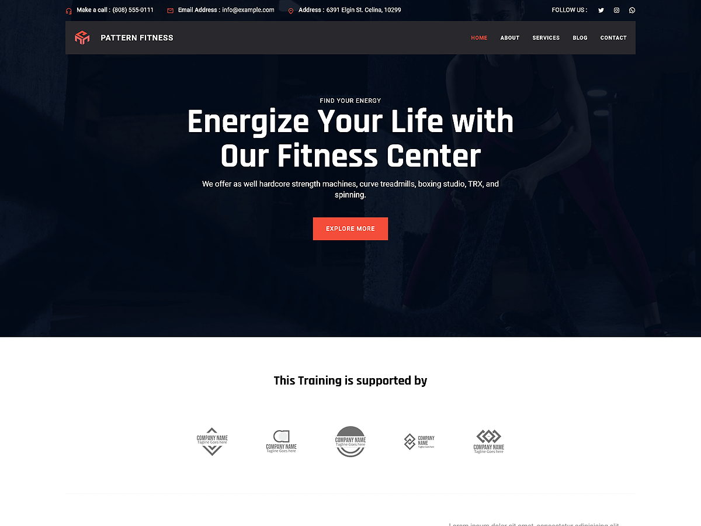

# Patterns Fitness

Patterns Fitness is a dynamic and modern WordPress theme crafted for gyms, fitness  studios, personal trainers, and wellness professionals. Built with WordPress Full Site Editing (FSE), this theme offers full control to customize headers, footers, templates, and global styles seamlessly through the WordPress Site Editor. The theme includes pre-built patterns and layouts specifically designed to highlight fitness programs, trainer profiles, pricing plans, testimonials, and contact forms. It also features layouts for showcasing services, about pages, team sections, galleries, and client success stories. With a clean, responsive design, Patterns Fitness ensures your website looks strong, professional, and accessible on all devices—providing a powerful online platform to motivate and engage your fitness community.

Primary color: `#f34e3a`.



## Features

- 3 hero and landing patterns
- 6 card layouts (card-1 through card-6)
- 1 service section pattern
- 5 archive/post-listing patterns
- Contact page pattern (page-contact)
- 1 menu navigation pattern
- 16 section layout patterns (featured sections and section titles)
- Full Site Editing (FSE) support
- Responsive design
- 69 block patterns + 15 templates + 11 template parts
- Fitness-oriented layouts (classes, trainers, schedules)

## Requirements

- WordPress 6.6 or higher
- PHP 7.0 or higher
- Tested up to WordPress 6.7

## Development

This theme uses `@wordpress/scripts`:

```sh
npm install
npm run start    # dev mode with watch
npm run build    # production build
```

## License

GNU General Public License v2 or later.

This theme is based on [WP Block Theme Boilerplate](https://github.com/codersantosh/wp-block-theme-boilerplate), (C) 2025 Santosh Kunwar, [GPLv2 or later](https://www.gnu.org/licenses/gpl-2.0.html).
